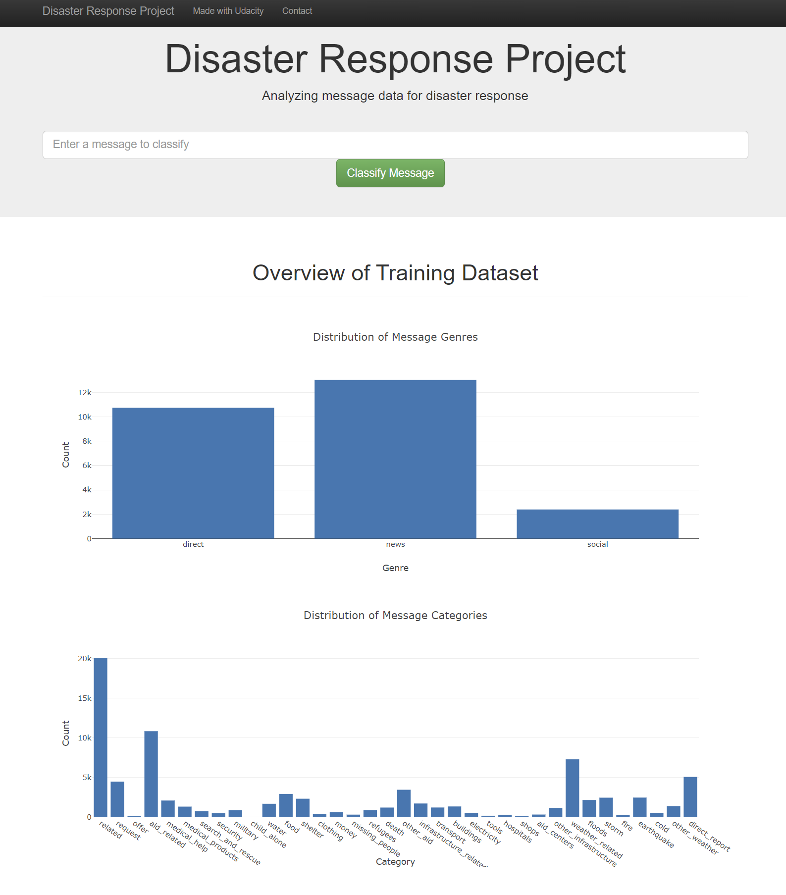

# Disaster Response Pipeline Project



## Welcome to the Future of Disaster Response

In a world where every second counts, the Disaster Response Pipeline Project stands as a beacon of hope and innovation. Developed through a pioneering collaboration between Udacity's Data Science Nanodegree Program and Figure Eight, this project leverages cutting-edge Natural Language Processing (NLP) and Machine Learning (ML) to sift through the chaos of disaster data, enabling responders to act swiftly and save lives.

## Quick Navigation

- [Why This Matters](#why-this-matters)
- [Technology Stack](#technology-stack)
- [Setup & Installation](#setup--installation)
- [How It Works](#how-it-works)
- [Dive Into the Web App](#dive-into-the-web-app)
- [Contributing to the Cause](#contributing-to-the-cause)
- [Acknowledgements](#acknowledgements)
- [Gallery](#gallery)

## Why This Matters

In the aftermath of a disaster, every moment is critical. Emergency teams struggle to process the flood of information. The Disaster Response Pipeline Project cuts through the noise, categorizing messages and alerts in real time, ensuring that help arrives where it's needed most, efficiently and effectively.

## Technology Stack

- **Languages**: Python 3.7
- **Libraries**: NumPy, Pandas, Scikit-Learn for ML; NLTK for NLP; SQLAlchemy for database operations; Flask and Plotly for web app and data visualization.
- **Database**: SQLite for lightweight and efficient data storage.
- **Machine Learning**: Custom-built classification models trained on real-world data.

## Setup & Installation

Ensure you have Python 3.5+ installed. Clone this repository to get started:

```shell
git clone https://github.com/matteobonanomi/disaster-response.git
cd disaster-response
```
Install dependencies:
```shell
pip install -r requirements.txt
```

## How It Works

**ETL Pipeline**: Extract data from source, clean, and store it in a SQLite database.
**ML Pipeline**: Train a model to classify disaster messages into categories.
**Web App**: Visualize the results and provide an interface for real-time classification.

### Running the Application:
**1.Prepare the data and model**:

```shell
python data/process_data.py data/disaster_messages.csv data/disaster_categories.csv data/DisasterResponse.db
python models/train_classifier.py data/DisasterResponse.db models/classifier.pkl
```
**2.Launch the web app**:
```shell
python app/run.py
```

View the application at: http://0.0.0.0:3001/

## Dive Into the Web App
Explore interactive visualizations and use the message classifier to see the model in action. It's not just about technology; it's about making a difference when it matters most.

## Contributing to the Cause
We welcome contributions! Whether you're fixing bugs, adding features, or improving documentation, your help makes a big difference. Check out our CONTRIBUTING.md for guidelines on how to contribute.

## Acknowledgements
A heartfelt thanks to Udacity for providing a platform for learning and innovation, and to Figure Eight for the critical data that powers this project. Together, we're building a better response for tomorrow's disasters.

## Gallery
Screenshots of the web app in action:

Message Classification: Quickly understand the needs in real-time.

Visualization Dashboard: Gain insights from the data.


## Summary & Call to Action

The Disaster Response Pipeline Project is more than just a technological solution; it's a pivotal step towards transforming how we respond to disasters globally. By harnessing the power of data science, machine learning, and natural language processing, this project offers a scalable, efficient, and effective approach to disaster response, ensuring that aid reaches those who need it most, when they need it.

### Key Takeaways

- **Innovative Approach**: Leveraging advanced NLP and ML techniques, the project categorizes and analyzes disaster-related messages in real time, streamlining the response process.
- **Impactful Collaboration**: A testament to the power of collaboration between academic institutions, tech innovators, and humanitarian organizations.
- **Open for Contribution**: This project thrives on community involvement. Whether you're a coder, a data scientist, or simply someone passionate about making a difference, your contribution can lead to significant improvements in disaster response efforts.
- **Educational Value**: For students and professionals alike, this project serves as a real-world application of data science, offering valuable insights into the practical challenges and opportunities in the field.
- **Future-Ready**: As disasters become more frequent and complex, the need for smart response mechanisms has never been greater. This project lays the groundwork for future innovations in the space.

Your engagement can transform the way we respond to disasters. Join us in this journey towards a smarter, faster, and more effective response system. Together, we can build a resilient framework that not only addresses the immediate challenges but also prepares us for the uncertainties of the future.

Let's make a difference, one message at a time.
Your engagement can transform the way we respond to disasters. Join us in this journey towards a smarter, faster, and more effective response system.